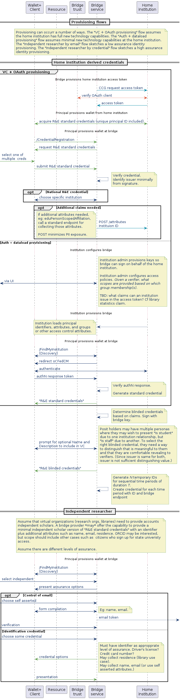

# Provisioning

There are multiple provisioning requirements.

The primary provisioning problem is how the bridge and the home institution or virtual organization establish, given a principal and a verifier, what the response document contains.

The "Home institution derived credentials" diagram illustrates two different high level flows for that.

The "VC + OAuth provisioning" flow assumes the home institution has full new technology capabilities, and that the bridge can make calls back to the originating institution for the response document.

The "Auth + dataload provisioning" flow assumes minimal new technology capabilities at the home institution, and that all the access control policy calculations occur at the bridge.

## Virtual organization

Virtual organizations bootstrap their identities on other organization identities (and thus may have a use case for 'independent researchers').

## Independent researchers

[ ] library access for community members?

The "Independent researcher by email" flow sketches a low assurance identity provisioning. The "Independent researcher by credential" flow sketches a high assurance  identity provisioning. Unclear what credentials offer a high assurance account recovery identifier.

